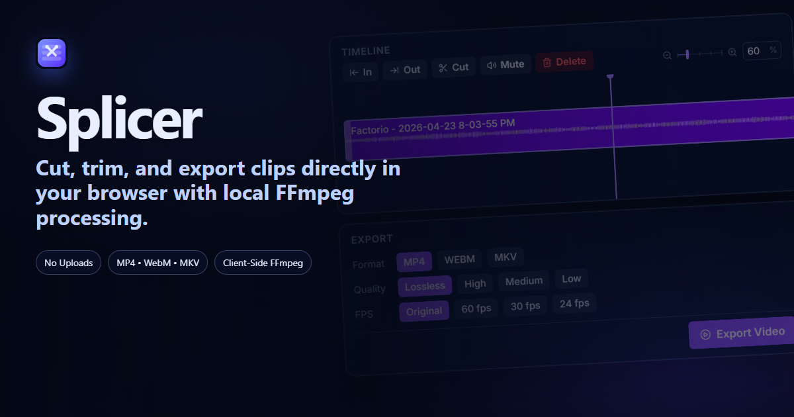
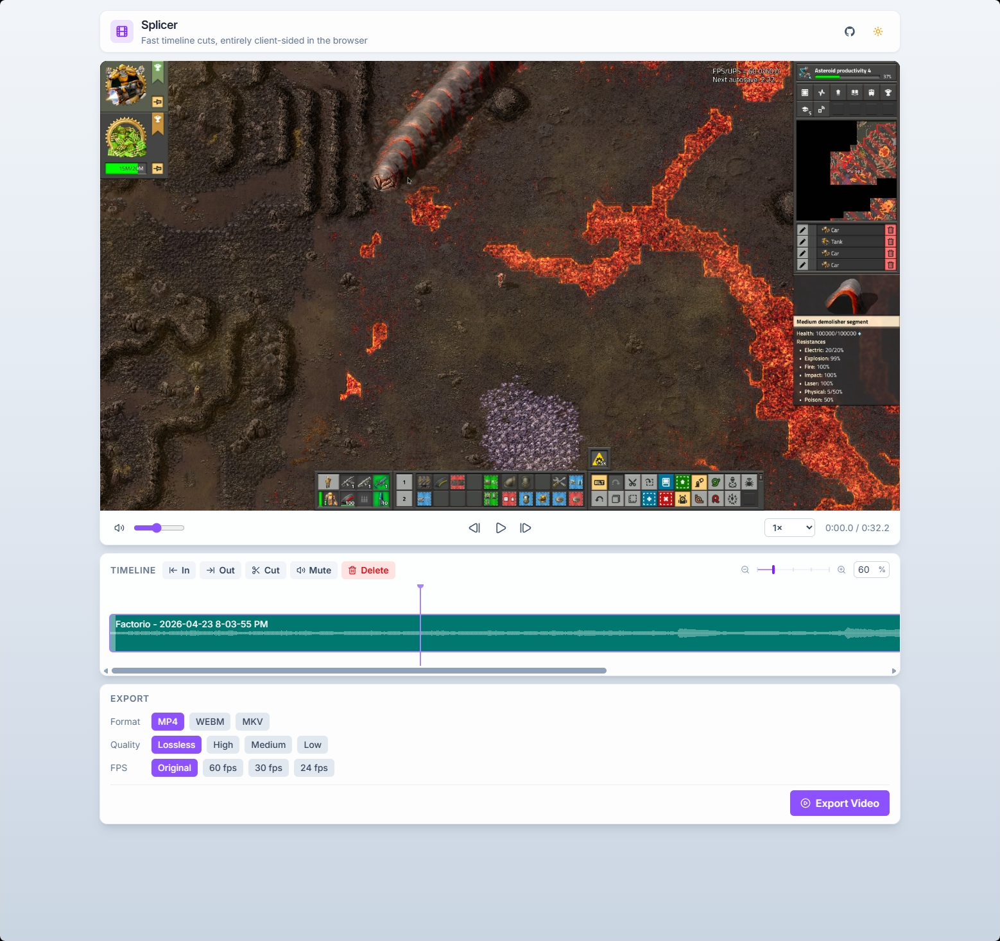
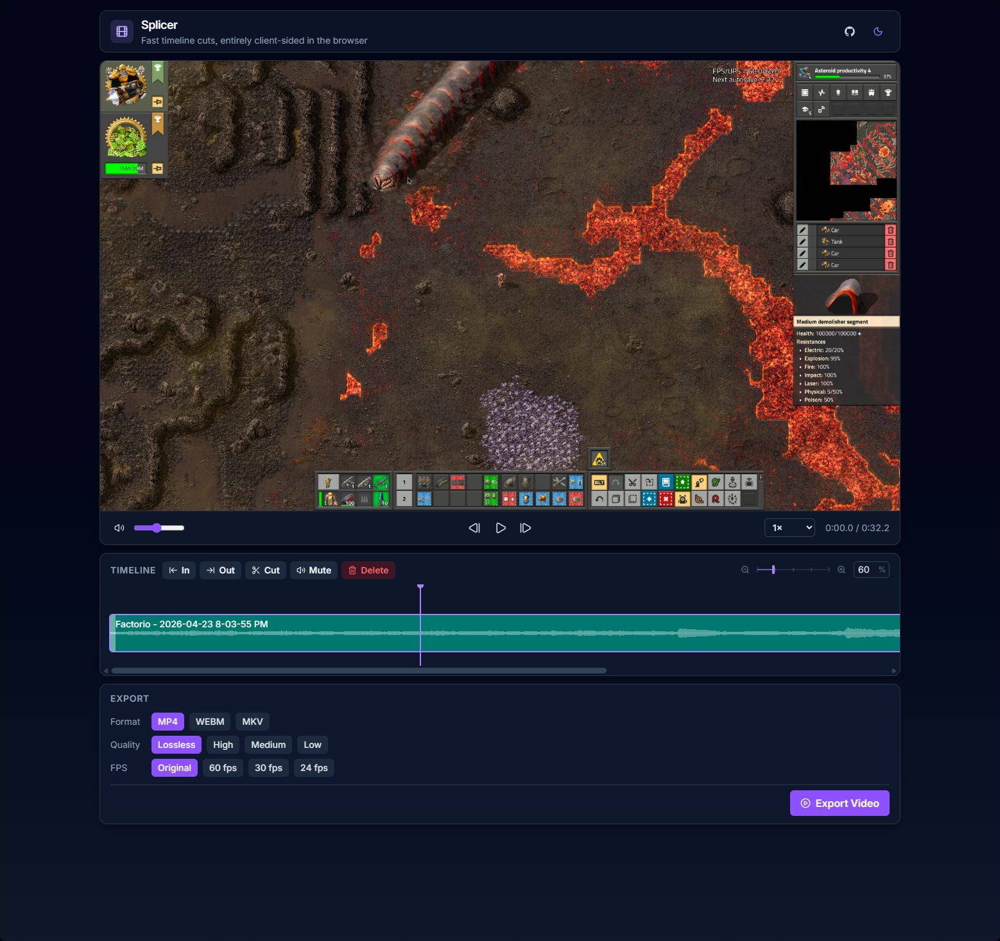

# Splicer



Splicer is a browser-based video timeline cutter built with Astro + Preact + FFmpeg (WebAssembly).

It is designed for fast, local edits:

- import clips by click or drag-and-drop
- trim in/out points and split at the playhead
- mute/unmute individual segments
- preview edits with frame stepping and playback speed controls
- export to MP4, WebM, or MKV directly in the browser

No upload pipeline is used. Processing happens client-side via FFmpeg WASM.

## App Screenshots

### Light Theme



### Dark Theme



## Core Capabilities

### Timeline Editing

- Append one or more video files to the timeline.
- Select segments and:
  - set in-point
  - set out-point
  - cut at playhead
  - mute/unmute
  - delete
- Drag segment trim handles for interactive left/right trimming.
- Seek by clicking/dragging in the timeline.

### Playback

- Segment-aware preview player.
- Playback speed: `0.25x` to `2x`.
- Frame stepping controls.
- Automatic segment advance during playback.

### Export

- Formats: `mp4`, `webm`, `mkv`
- Quality presets: `lossless`, `high`, `medium`, `low`
- Framerate options: `original`, `60`, `30`, `24`
- Export progress + cancel support.
- Export history table with one-click download and drag-to-desktop support.

## Keyboard Shortcuts

- `Space`: Play/Pause
- `ArrowLeft` or `,`: Step back one frame
- `ArrowRight` or `.`: Step forward one frame
- `-`: Zoom timeline out
- `=`: Zoom timeline in
- `Ctrl` + mouse wheel up/down: Zoom timeline in/out at cursor
- `Enter` (while focused in zoom % field): Apply typed zoom level
- `I`: Set in-point
- `O`: Set out-point
- `M`: Toggle mute on selected segment
- `Delete` / `Backspace`: Delete selected segment

## Tech Stack

- Astro
- Preact + Signals
- Tailwind CSS
- FFmpeg WASM (`@ffmpeg/ffmpeg`, `@ffmpeg/core`, `@ffmpeg/util`)

## Requirements

- Node.js `>= 22.12.0`
- pnpm

## Getting Started

```bash
pnpm install
pnpm dev
```

Open `http://localhost:4321`.

## Implementation Notes

### FFmpeg Core Delivery

This project serves `ffmpeg-core.js` from `node_modules` in development through a Vite plugin and copies it into `dist/ffmpeg` at build time.

`ffmpeg-core.wasm` is expected at `public/ffmpeg/ffmpeg-core.wasm`.

### Cross-Origin Isolation

The app config sets the following headers in dev and preview:

- `Cross-Origin-Opener-Policy: same-origin`
- `Cross-Origin-Embedder-Policy: require-corp`

These are required for stable FFmpeg WASM execution in the browser.

### Export Path Optimization

When all of the following are true:

- quality = `lossless`
- fps = `original`
- no muted segments

Splicer uses a stream-copy concat path (`-c copy`) to avoid re-encoding.

## Usage Guidelines

- Prefer source clips with compatible codecs/containers when aiming for fastest export.
- Use `lossless + original fps` for near-instant remux exports when possible.
- Use `high`/`medium` presets for smaller files when re-encoding is acceptable.
- Large clips can consume significant memory in browser sessions; close/reload tab if memory pressure grows.

## Current Limitations

- Project state is in-memory only (no save/load project file).
- Export history is session-only and clears on refresh.
- No multi-track composition.
