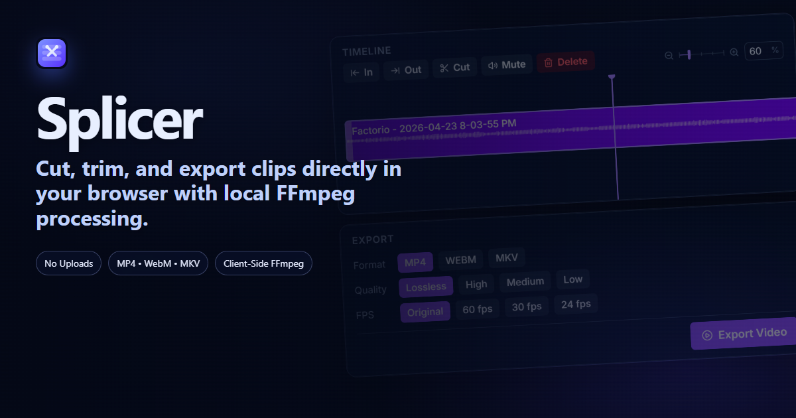
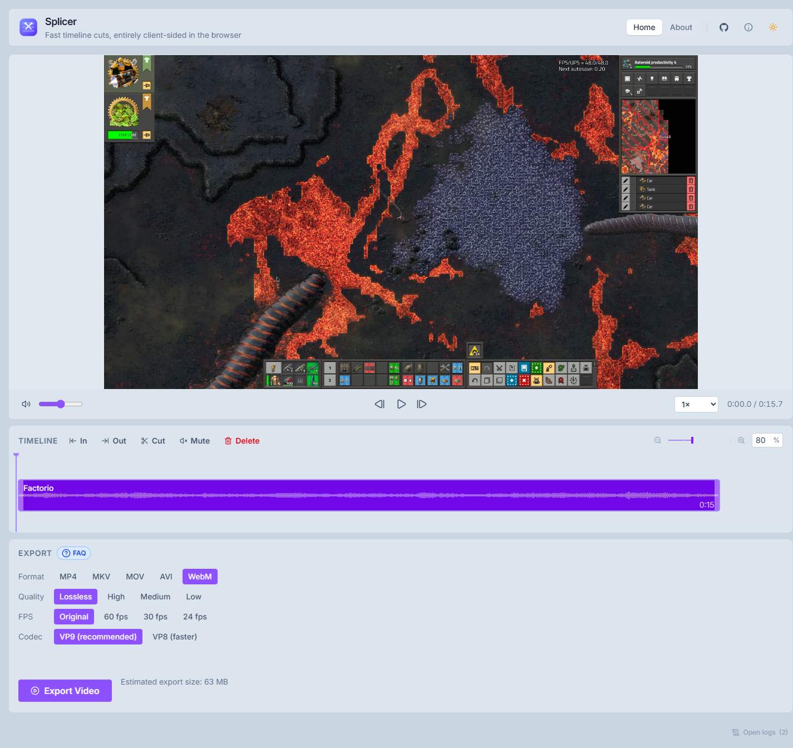
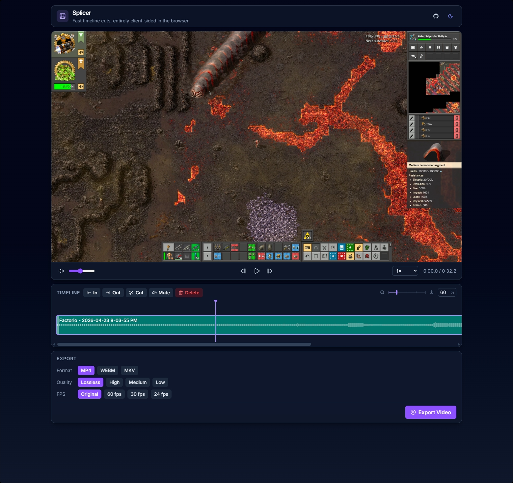

# Splicer



Splicer is a browser-based video timeline cutter built with Astro + Preact. It exports entirely in-browser using the native WebCodecs API for decode and encode, with mediabunny handling demux and muxing.

It is designed for fast, local edits:

- import clips by click or drag-and-drop
- trim in/out points and split at the playhead
- preview edits with frame stepping and playback speed controls
- export to MP4, MKV, MOV, or WebM directly in the browser

No upload pipeline is used. Processing happens entirely client-side via WebCodecs.

## App Screenshots

### Light Theme



### Dark Theme



## Core Capabilities

### Timeline Editing

- Append one or more video files to the timeline.
- Select segments and:
  - set in-point
  - set out-point
  - cut at playhead
  - delete
- Drag segment trim handles for interactive left/right trimming.
- Seek by clicking/dragging in the timeline.

### Playback

- Segment-aware preview player.
- Playback speed: `0.25x` to `2x`.
- Frame stepping controls.
- Automatic segment advance during playback.

### Export

- Formats: `mp4`, `mkv`, `mov`, `webm`
- Quality presets: `lossless`, `high`, `medium`, `low`
- Framerate options: `original`, `60`, `30`, `24`
- WebM codec choice: `VP9` (recommended, smaller files) or `VP8` (faster to encode).
- A single WebCodecs export engine (runs in a Web Worker) handles every format and resolution, including HD sources, with bounded memory regardless of clip length.
- Export progress + cancel support.
- Export history table with one-click download and drag-to-desktop support.
- In-app "Export & quality FAQ" plus an `/about` guide explaining containers vs codecs and how to avoid quality loss.

### Per-Segment Mute

- Toggle mute on a selected segment via the timeline toolbar button or `M` key.
- Muted segments show a 🔇 indicator on the segment block.
- Preview playback respects per-segment mute immediately.
- Exported video silences muted segments (the WebCodecs engine fills the segment with silence).

## Keyboard Shortcuts

- `Space`: Play/Pause
- `ArrowLeft` or `,`: Step back one frame
- `ArrowRight` or `.`: Step forward one frame
- `-`: Zoom timeline out
- `=`: Zoom timeline in
- `Ctrl` + mouse wheel up/down: Zoom timeline in/out at cursor
- `Enter` (while focused in zoom % field): Apply typed zoom level
- `I`: Set in-point
- `O`: Set out-point
- `C`: Cut at playhead
- `M`: Toggle mute on selected segment
- `Delete` / `Backspace`: Delete selected segment
- `Ctrl` + `Z`: Undo
- `Ctrl` + `Shift` + `Z` or `Ctrl` + `Y`: Redo

## Tech Stack

- Astro
- Preact + Signals
- Tailwind CSS
- WebCodecs (`VideoEncoder` / `VideoDecoder` / `AudioEncoder` / `AudioDecoder`)
- `mediabunny` (demux and muxing) with `@mediabunny/aac-encoder` for AAC where the browser lacks native support

## Requirements

- Node.js `>= 22.12.0`
- pnpm

## Getting Started

```bash
pnpm install
pnpm dev
```

Open `http://localhost:4321`.

## Implementation Notes

### WebCodecs Export Engine

Every export runs through the browser's native WebCodecs API:

- The full decode -> edit -> encode -> mux pipeline runs in a dedicated Web Worker, so memory stays bounded regardless of clip length.
- Sources are demuxed and muxed with mediabunny, and re-encoded with the browser's `VideoEncoder` / `AudioEncoder` (AVC/AAC for MP4/MOV, VP8/VP9 + Opus for WebM, configurable for MKV).
- A capability gate checks encoder/decoder support up front. When WebCodecs is unavailable or the source is not demuxable, the export surfaces an honest error rather than falling back.
- This path handles HD sources (e.g. 1080p60) in-browser.

## Usage Guidelines

- Use `high`/`medium` presets for smaller files; use `lossless` to stay closest to the source.
- For WebM, prefer `VP9` for smaller files at similar quality; choose `VP8` when encode speed matters more than size.
- Every export re-encodes, so a perfectly lossless copy is not possible. To keep quality highest, export to the same format as your source at `lossless + original fps`. See the in-app FAQ or `/about` for the full explanation.
- Large clips can consume significant memory in browser sessions; close/reload tab if memory pressure grows.

## Current Limitations

- Project state is in-memory only (no save/load project file).
- Export history is session-only and clears on refresh.
- No multi-track composition.
- WebCodecs export requires a supporting browser (recent Chromium, Edge, or Safari). Without it, export is unavailable.
